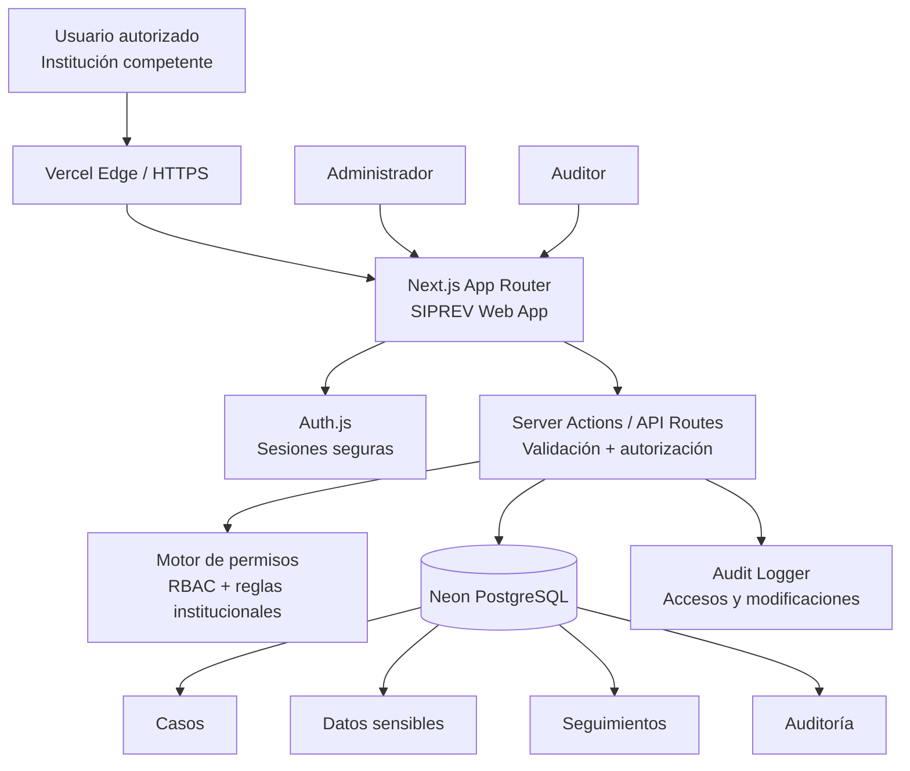
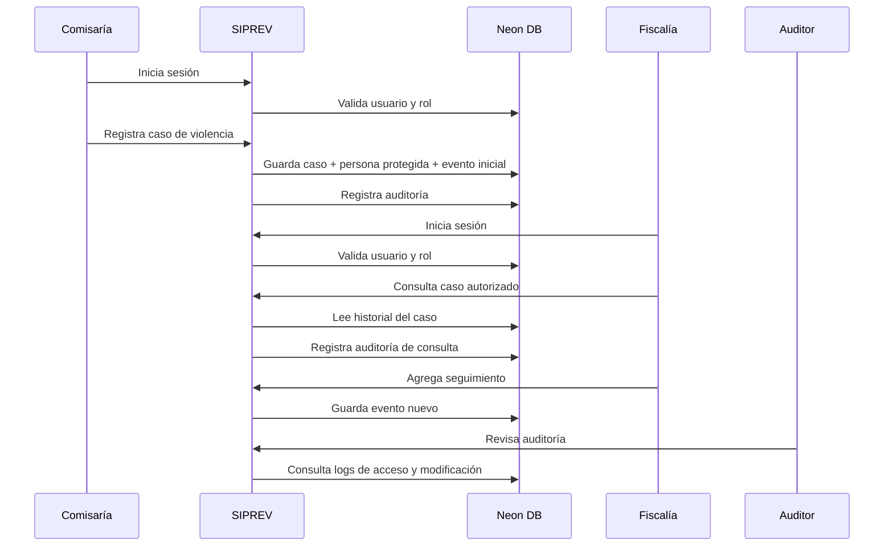

# SIPREV — Plan de construcción del piloto

> **For Hermes:** Use subagent-driven-development skill to implement this plan task-by-task.

**Goal:** Construir un piloto funcional de SIPREV, Sistema Protegido de Registro de Violencia, con login institucional, registro de casos, consulta autorizada, seguimiento histórico y diagrama de arquitectura.

**Architecture:** Aplicación web Next.js desplegada en Vercel, con base de datos PostgreSQL en Neon. El sistema debe tratar los datos como información sensible con reserva legal: acceso mínimo necesario, roles, auditoría, trazabilidad y datos demo sintéticos para el piloto.

**Tech Stack:** Next.js App Router, TypeScript, Tailwind CSS, PostgreSQL Neon, Prisma o Drizzle ORM, Auth.js para autenticación demo, Vercel hosting, tests con Vitest/Playwright según alcance.

---

## 1. Lectura del requerimiento

El cliente está pidiendo algo parecido al concepto de historia clínica, pero aplicado a casos de violencia:

- Un registro protegido y centralizado.
- Acceso solo para usuarios autorizados de instituciones competentes.
- Continuidad del trámite aunque la persona cambie de institución.
- Consulta del historial anterior del caso/trámite.
- Carga de nuevos casos de violencia.
- Seguimiento y trazabilidad del caso.

La idea central no es “una página informativa”. Es un sistema de información sensible interinstitucional. Eso cambia TODO: seguridad, permisos, auditoría y responsabilidad legal no son detalles posteriores; son parte del producto desde el día uno.

---

## 2. Definición propuesta del producto

SIPREV será un sistema web protegido donde usuarios institucionales autorizados pueden:

1. Iniciar sesión.
2. Registrar un caso de violencia.
3. Consultar casos existentes según su nivel de autorización.
4. Ver historial de actuaciones previas, sin depender de la institución donde se encuentre el caso.
5. Agregar seguimientos, observaciones y actuaciones.
6. Dejar trazabilidad de cada acceso y modificación.

### Nombre

SIPREV — Sistema Protegido de Registro de Violencia.

### Propósito

Evitar pérdida, fragmentación o repetición de información sensible entre instituciones, permitiendo continuidad en la atención y seguimiento de casos de violencia bajo reserva legal.

---

## 3. Principios no negociables

Estos principios deben estar en el diseño desde el piloto, aunque el piloto use datos falsos.

| Principio | Decisión |
|---|---|
| Reserva legal | El sistema no debe exponer información a usuarios no autorizados. |
| Mínimo privilegio | Cada usuario ve solo lo que necesita según rol, institución, competencia y asignación. |
| Trazabilidad | Cada consulta, creación, edición y seguimiento debe quedar auditado. |
| Datos sintéticos en demo | La demo pública no debe usar datos reales ni identificables. |
| Sin registro público | Los usuarios deben ser creados/invitados por administradores. |
| Continuidad interinstitucional | El historial del caso debe vivir en SIPREV, no en una institución aislada. |
| Separación de identidad y caso | Evitar exponer datos personales cuando basta con código de caso o datos mínimos. |

---

## 4. Alcance recomendado para el piloto

El piloto debe demostrar el flujo completo, pero sin intentar resolver todo el sistema final. Si metemos todo de entrada, hacemos un monstruo inmantenible. Primero el “tracer bullet”: de punta a punta, chico, seguro y demostrable.

### Incluido en el piloto

- Landing/login privado.
- Usuarios demo precreados.
- Roles básicos.
- Dashboard institucional.
- Registro de caso.
- Listado y búsqueda de casos autorizados.
- Vista detalle del caso.
- Línea de tiempo de actuaciones/seguimientos.
- Creación de seguimiento.
- Registro visible de auditoría para administradores.
- Diagrama de arquitectura.
- Datos seed sintéticos.
- Deploy gratuito en Vercel + Neon.

### Fuera del piloto inicial

- Datos reales.
- Carga masiva de documentos.
- Firma digital.
- Integración con sistemas externos.
- Interoperabilidad oficial con otras entidades.
- Notificaciones SMS/email productivas.
- Analítica avanzada.
- Flujos judiciales completos.
- Almacenamiento de archivos sensibles.

---

## 5. Roles del sistema

| Rol | Permisos principales |
|---|---|
| Administrador del sistema | Gestiona instituciones, usuarios, roles y auditoría global. |
| Administrador institucional | Gestiona usuarios de su institución y ve casos permitidos de su institución. |
| Profesional autorizado | Crea casos, consulta casos autorizados y agrega seguimientos. |
| Consultor/auditor | Puede revisar trazabilidad y accesos, sin modificar casos. |

### Creación de usuarios

Para SIPREV no debe existir registro público. Los usuarios deben crearse por administración o invitación controlada.

Para el piloto:

- Usuarios demo creados por seed o manualmente por el equipo técnico.
- Un administrador del sistema puede ver la estructura prevista de gestión de usuarios.
- Si el tiempo alcanza, se implementa una pantalla simple para crear usuarios institucionales.

Para producción:

- Administrador del sistema crea instituciones y administradores institucionales.
- Administrador institucional solicita o crea usuarios de su entidad.
- Las cuentas deben poder quedar en estado `pending`, `active`, `suspended` o `revoked`.
- Toda creación, cambio de rol, suspensión o reactivación debe quedar en auditoría.
- Idealmente, altas sensibles requieren aprobación o verificación institucional antes de activar la cuenta.

Para producción habría que evolucionar esto a RBAC + ABAC: rol + institución + competencia territorial + tipo de caso + asignación explícita.

---

## 6. Modelo inicial de datos

### Entidades principales

| Entidad | Propósito |
|---|---|
| Institution | Institución competente: comisaría, fiscalía, secretaría, entidad de atención, etc. |
| User | Usuario autorizado del sistema. |
| Role | Rol de acceso. |
| Case | Caso de violencia registrado. |
| ProtectedPerson | Persona afectada o sujeto protegido, con datos sensibles. |
| AggressorReference | Información mínima del presunto agresor, si aplica. |
| CaseEvent | Actuación o seguimiento dentro del caso. |
| CaseAssignment | Asignación de caso a institución/usuario. |
| AuditLog | Registro inmutable de accesos y acciones. |

### Campos sugeridos para Case

- id
- publicCode: código legible del caso, no secuencial sensible
- caseType: tipo de violencia
- riskLevel: bajo / medio / alto / crítico
- status: abierto / en seguimiento / remitido / cerrado
- reportingInstitutionId
- currentInstitutionId
- createdByUserId
- createdAt
- updatedAt

### Campos sugeridos para ProtectedPerson

- id
- caseId
- documentType
- documentNumberEncrypted o documentNumberHash
- fullNameEncrypted
- birthDateEncrypted
- contactInfoEncrypted
- addressEncrypted

Para demo se puede guardar texto normal porque será sintético. Para producción, datos personales sensibles deben cifrarse y tener política clara de acceso, retención y auditoría.

---

## 7. Arquitectura propuesta

### Lectura arquitectónica

- Vercel aloja la aplicación y fuerza HTTPS.
- Next.js maneja UI, rutas protegidas y acciones del servidor.
- Auth.js permite login demo con usuarios precreados.
- Neon PostgreSQL guarda casos, usuarios, instituciones, seguimientos y auditoría.
- El motor de permisos decide qué puede ver cada usuario.
- El audit logger registra toda consulta sensible.

---

## 8. Seguridad mínima para el piloto

Aunque sea demo, el diseño debe mostrar madurez:

- Login obligatorio.
- Sin registro público.
- Usuarios seed por institución.
- Passwords hasheadas.
- Cookies httpOnly.
- Validación de entrada con schemas.
- Autorización en servidor, no solo en UI.
- Auditoría de accesos a caso.
- No mostrar datos sensibles en listados generales.
- No usar datos reales.
- Variables secretas en Vercel Environment Variables.
- `DATABASE_URL` de Neon solo en servidor.

### Advertencia importante

Vercel + Neon free sirve para demo o piloto conceptual. Para producción con reserva legal, hay que revisar:

- cumplimiento normativo aplicable;
- cifrado de datos sensibles;
- backups;
- retención y eliminación;
- auditoría no repudiable;
- acuerdos institucionales;
- seguridad operacional;
- plan de respuesta a incidentes.

Gratis está bien para demostrar valor. No está bien para custodiar datos reales sin diseño legal/técnico serio.

---

## 9. Flujo demo recomendado

La demo debe contar una historia clara:

### Usuarios demo

| Usuario | Institución | Rol |
|---|---|---|
| admin@siprev.demo | SIPREV Central | Administrador |
| comisaria@siprev.demo | Comisaría de Familia | Profesional autorizado |
| fiscalia@siprev.demo | Fiscalía | Profesional autorizado |
| auditor@siprev.demo | Control Interno | Auditor |

### Historia de demostración

1. El usuario de Comisaría inicia sesión.
2. Crea un caso de violencia con datos sintéticos.
3. Agrega una primera actuación: recepción, valoración de riesgo y medidas iniciales.
4. El caso queda disponible en la línea de tiempo.
5. El usuario de Fiscalía inicia sesión.
6. Consulta el caso autorizado y ve el historial anterior sin depender de Comisaría.
7. Fiscalía agrega seguimiento.
8. El auditor entra y revisa qué usuarios accedieron o modificaron el caso.

Ese flujo demuestra el valor real: continuidad interinstitucional + reserva + trazabilidad.

---

## 10. Pantallas del piloto

### 1. Login

- Logo/nombre SIPREV.
- Mensaje: “Acceso exclusivo para usuarios autorizados”.
- Email y contraseña.
- Aviso de reserva legal.

### 2. Dashboard

- Casos recientes autorizados.
- Casos por estado.
- Casos por nivel de riesgo.
- Acceso rápido a “Nuevo caso”.

### 3. Nuevo caso

- Datos generales del caso.
- Datos mínimos de la persona afectada.
- Tipo de violencia.
- Nivel de riesgo.
- Institución que registra.
- Observación inicial.

### 4. Búsqueda de casos

- Buscar por código de caso.
- Buscar por documento, solo si el rol lo permite.
- Filtros por estado, riesgo, institución y fecha.
- Listado con datos mínimos.

### 5. Detalle del caso

- Encabezado con código, estado y riesgo.
- Datos protegidos según permisos.
- Institución actual.
- Línea de tiempo.
- Botón “Agregar seguimiento”.

### 6. Agregar seguimiento

- Tipo de actuación.
- Descripción.
- Próxima acción.
- Cambio de estado, si aplica.

### 7. Auditoría

- Usuario.
- Acción.
- Caso consultado/modificado.
- Fecha/hora.
- IP o metadata disponible.

---

## 11. Plan de construcción por fases

### Fase 0 — Alineación funcional

**Objetivo:** Convertir la idea del cliente en alcance demo claro.

**Tareas:**

1. Definir actores institucionales reales.
2. Confirmar qué significa “reserva legal” en el contexto del cliente.
3. Definir qué datos mínimos debe tener un caso.
4. Definir qué instituciones pueden ver qué información.
5. Definir historia demo con datos falsos.

**Resultado:** Documento corto de alcance y supuestos.

---

### Fase 1 — Base técnica

**Objetivo:** Crear la aplicación base desplegable.

**Tareas:**

1. Crear proyecto Next.js con TypeScript.
2. Configurar Tailwind CSS.
3. Configurar conexión a Neon.
4. Configurar ORM: Prisma o Drizzle.
5. Configurar variables de entorno.
6. Crear layout base SIPREV.
7. Preparar deploy en Vercel.

**Validación:**

- App corre localmente.
- Build pasa.
- Vercel despliega.
- Neon responde desde la app.

---

### Fase 2 — Modelo de datos y seed demo

**Objetivo:** Crear estructura mínima para usuarios, instituciones, casos y seguimiento.

**Tareas:**

1. Crear tablas de instituciones.
2. Crear tablas de usuarios/roles.
3. Crear tablas de casos.
4. Crear tablas de personas protegidas.
5. Crear tablas de seguimientos.
6. Crear tabla de auditoría.
7. Crear seed con usuarios e instituciones demo.
8. Crear seed con casos sintéticos.

**Validación:**

- Migraciones aplican en Neon.
- Seed carga usuarios demo.
- No hay datos reales.

---

### Fase 3 — Autenticación y autorización

**Objetivo:** Proteger el sistema y limitar accesos.

**Tareas:**

1. Configurar Auth.js.
2. Crear login con usuarios precreados.
3. Proteger rutas privadas.
4. Crear helper `requireUser`.
5. Crear helper `canAccessCase`.
6. Aplicar autorización en consultas y acciones.
7. Registrar accesos sensibles en auditoría.

**Validación:**

- Usuario no autenticado no accede al dashboard.
- Usuario autenticado ve solo rutas autorizadas.
- Acceso a caso genera AuditLog.

---

### Fase 4 — Registro de casos

**Objetivo:** Permitir crear casos de violencia con datos mínimos.

**Tareas:**

1. Diseñar formulario de nuevo caso.
2. Crear schema de validación.
3. Guardar caso.
4. Guardar persona protegida.
5. Crear primer evento de timeline.
6. Registrar acción en auditoría.
7. Mostrar confirmación con código del caso.

**Validación:**

- Caso se crea correctamente.
- Datos inválidos se rechazan.
- Caso aparece en dashboard/listado.

---

### Fase 5 — Consulta y seguimiento

**Objetivo:** Demostrar continuidad interinstitucional.

**Tareas:**

1. Crear listado de casos autorizados.
2. Crear filtros básicos.
3. Crear página de detalle.
4. Mostrar línea de tiempo.
5. Crear formulario de seguimiento.
6. Permitir cambio de estado.
7. Registrar seguimiento y auditoría.

**Validación:**

- Usuario de una institución puede ver historial autorizado.
- Seguimiento nuevo aparece en timeline.
- Auditoría registra consulta y modificación.

---

### Fase 6 — Auditoría y demo polish

**Objetivo:** Preparar la demo para cliente.

**Tareas:**

1. Crear vista de auditoría para admin/auditor.
2. Mejorar copy de reserva legal.
3. Crear datos demo realistas pero falsos.
4. Crear diagrama final en HTML o Mermaid.
5. Crear README con flujo demo.
6. Preparar Vercel deployment.
7. Revisar responsive básico.

**Validación:**

- Demo completa ejecutable de punta a punta.
- Diagrama explica arquitectura y flujo.
- README permite repetir la demo.

---

## 12. Diagrama funcional del flujo

---

## 13. Recomendación de stack detallado

| Capa | Recomendación | Motivo |
|---|---|---|
| Frontend | Next.js App Router | Despliegue directo en Vercel y server actions. |
| UI | Tailwind CSS | Rápido para piloto y visual consistente. |
| Auth demo | Auth.js | Control propio, compatible con Next.js. |
| DB | Neon PostgreSQL | Free tier, Postgres real, buen punto de partida. |
| ORM | Prisma o Drizzle | Prisma acelera modelado; Drizzle da más control SQL. |
| Validación | Zod | Validación compartible y clara. |
| Deploy | Vercel | Gratis y simple para demo. |
| Testing | Vitest + Playwright básico | Unit/integration + smoke de demo. |

### Decisión recomendada

Para piloto: Next.js + Prisma + Auth.js + Neon.

Por qué: baja fricción, rápido de explicar, fácil de desplegar y suficiente para demostrar el flujo.

---

## 14. Pruebas mínimas

### Unitarias/integración

- Validación de formulario de caso.
- Usuario sin sesión no accede a rutas privadas.
- Usuario sin permiso no accede a caso.
- Crear caso crea evento inicial.
- Consultar caso crea audit log.
- Agregar seguimiento crea evento y audit log.

### Smoke demo

- Login como Comisaría.
- Crear caso.
- Login como Fiscalía.
- Consultar caso.
- Agregar seguimiento.
- Login como Auditor.
- Ver logs.

---

## 15. Riesgos y decisiones pendientes

| Riesgo / pregunta | Impacto | Recomendación |
|---|---|---|
| ¿Qué entidades son “instituciones competentes”? | Define permisos reales. | Preguntarlo antes de producción. |
| ¿Qué datos tienen reserva legal? | Define cifrado y acceso. | Tratar todos los datos personales como sensibles. |
| ¿Puede una institución ver casos de otra? | Núcleo del sistema. | Definir reglas por competencia, no por curiosidad. |
| ¿Se requieren documentos adjuntos? | Riesgo alto de seguridad. | Excluir del piloto inicial. |
| ¿Habrá datos reales en piloto? | Riesgo legal. | No. Solo sintéticos. |
| ¿Vercel/Neon free sirve para producción? | Riesgo operativo/legal. | Solo demo; producción requiere revisión formal. |

---

## 16. Entregables sugeridos

1. Diagrama de arquitectura.
2. Diagrama de flujo funcional.
3. Piloto desplegado en Vercel.
4. Base Neon con seed demo.
5. README con credenciales demo y flujo.
6. Checklist de seguridad y límites del piloto.
7. Documento de preguntas para cliente antes de producción.

---

## 17. Primer corte recomendado

No arranquemos por “todas las funcionalidades”. Arranquemos por este corte:

1. Login.
2. Dashboard.
3. Crear caso.
4. Ver caso.
5. Agregar seguimiento.
6. Auditoría básica.
7. Deploy.
8. Diagrama.

Ese corte prueba el corazón del producto: una institución registra, otra consulta el historial, y todo queda auditado.

---

## 18. Respuestas de alcance ya definidas

El alcance queda ajustado así:

1. **Contexto del proyecto:** SIPREV será usado para una investigación de proyecto educativo. No custodiará datos reales. El objetivo es agregar peso académico a la investigación mostrando un software capaz de recopilar, organizar y consultar información de casos.
2. **Tipos de violencia iniciales:** para el piloto se usarán categorías comunes: violencia doméstica/intrafamiliar, violencia de género, violencia física, violencia psicológica, violencia sexual, violencia económica/patrimonial, negligencia o abandono, amenaza/intimidación y violencia digital si aplica. UN Women describe dentro de violencia doméstica manifestaciones físicas, sexuales, psicológicas y económicas, y también define violencia sexual como conducta sexual dañina o no deseada impuesta a una persona.[2]
3. **Datos mínimos tipo triage:** el formulario inicial debe parecerse a una admisión/triage básico, pero orientado a caso de violencia: identificación, nombres, edad/fecha de nacimiento, contacto seguro, dirección, institución que registra, fecha/hora de ingreso, lugar de los hechos, tipo de violencia, descripción breve, nivel de riesgo, estado emocional/físico observado, urgencia de atención, antecedentes relevantes, personas involucradas, medidas iniciales y observaciones.
4. **Regla de acceso interinstitucional:** por ahora no se implementará una regla compleja de autorización entre instituciones. Como es educativo, se manejará por roles demo. Aun así, la arquitectura dejará preparado el punto para evolucionar a permisos por institución/competencia.
5. **Entrega esperada:** se desarrollará y desplegará realmente usando Vercel para la aplicación y Neon PostgreSQL para la base de datos.

### Ajuste de enfoque por ser proyecto educativo

Como el proyecto es educativo, el piloto debe ser convincente pero responsable:

- Usar únicamente datos ficticios.
- Mostrar mensajes claros de “demo educativa”.
- Mantener login y roles para demostrar reserva y control de acceso.
- Evitar prometer cumplimiento legal/productivo.
- Explicar que una versión real requeriría validación jurídica, seguridad avanzada y acuerdos institucionales.

### Principio de evolución futura

Aunque SIPREV inicia como proyecto educativo, debe diseñarse como un piloto serio que pueda crecer si genera impacto. La demo no debe ser “un CRUD disfrazado”; debe parecer la primera versión controlada de un sistema real.

Decisiones para mantener esa puerta abierta:

- Arquitectura modular: separar autenticación, permisos, casos, auditoría y catálogo de instituciones.
- Autorización en servidor: nunca depender solo de esconder botones en la interfaz.
- Auditoría desde el inicio: registrar lectura, creación, edición, cambios de estado y gestión de usuarios.
- Modelo de roles extensible: comenzar con RBAC simple, dejando espacio para ABAC por institución, competencia territorial, tipo de caso y asignación.
- Migraciones versionadas: todo cambio de base de datos debe pasar por migraciones, no cambios manuales en Neon.
- Datos sensibles aislados: separar datos personales protegidos del resumen operativo del caso.
- Cifrado futuro: dejar identificados los campos que en producción deberían cifrarse o tokenizarse.
- Sin datos reales en demo: si algún día pasa a producción, se debe abrir una fase formal de endurecimiento legal, seguridad, infraestructura y privacidad.

### Roadmap de madurez

| Nivel | Uso | Características |
|---|---|---|
| Piloto educativo | Presentación/investigación | Datos sintéticos, login, roles, casos, seguimiento, auditoría básica, deploy Vercel/Neon. |
| Piloto institucional controlado | Validación con actores reales sin datos sensibles reales | Flujos revisados por expertos, permisos por institución, mejores reportes, hardening básico. |
| MVP productivo | Uso limitado con datos reales autorizados | Cifrado, auditoría fuerte, backups, retención, monitoreo, políticas legales, consentimiento/soporte institucional. |
| Sistema robusto | Operación interinstitucional | ABAC, interoperabilidad, alta disponibilidad, gestión documental segura, trazabilidad avanzada, cumplimiento normativo formal. |

## 19. Siguiente paso recomendado

El siguiente entregable debe ser visual y demostrable:

1. Crear el diagrama de arquitectura final.
2. Crear el diagrama de flujo funcional.
3. Construir el piloto navegable con datos demo.
4. Desplegar en Vercel conectado a Neon.
5. Preparar un guion de demo para la presentación educativa.

Sources:

[2] UN Women: Types of violence — https://www.unwomen.org/en/what-we-do/ending-violence-against-women/faqs/types-of-violence
